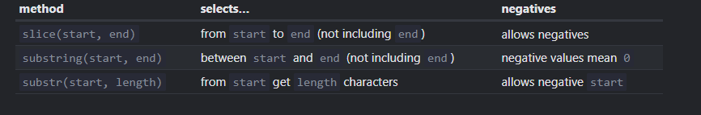

### null vs undefined
null is an explicit value representing "no value," while undefined means a variable has been declared but not yet assigned a value.
#
### parameters and arguements
Parameters are variables listed in the function definition, while arguments are the actual values passed to the function when it is called.
#
### function declarations  vs function expressions
Function declarations are hoisted and can be called before their definition, while function expressions are not hoisted and can only be called after they are defined.
#
### var, let, const 
**`let`** and **`const`** are block-scoped variables, while **`var`** is function-scoped. **`let`** allows reassignment, **`const`** does not (though it allows mutation of objects).
#
### what is singleton in js?
In JavaScript, a **singleton** is a design pattern that ensures a class has only one instance and provides a global point of access to that instance. This is often achieved by creating an object that controls access to its unique instance.
#
### what is garbage collection?
**Garbage collection** in JavaScript is the automatic process of identifying and reclaiming memory that is no longer in use by the program, freeing up resources and preventing memory leaks.
#
### what is 'this' in JS?
In JavaScript, `this` refers to the context in which a function is called, and its value is determined by how the function is invoked:
- **In a method**: Refers to the `object` the method is called on.
- **In a function**: Refers to the global object (`window` in browsers) or `undefined` in strict mode.
- **In an arrow function**: Inherits **this** from its enclosing `lexical context` and does not have its own `this`.
- **In an event handler**: Refers to the `element` that triggered the event.

Its value depends on how and where the function is invoked.
#
### why arrow functions dont have `this`?
Arrow functions don’t have their own **`this`** context; instead, they inherit **`this`** from the surrounding **lexical context** where they are defined. This makes them useful for scenarios where you want to preserve the **`this`** value from an outer function or scope.
#
### what is a lexical context?
**Lexical context** refers to the environment in which a function is defined, including its scope and variables. It determines how variables and `this` are accessed within that function. In JavaScript, this context is established at the time the function is defined, not when it is invoked.
#
### what are constructors?
**Constructors** in JavaScript are special functions used to create and initialize objects. They are typically defined using the `function` keyword or as a class method and are called with the `new` keyword to create new instances of objects. Constructors set up initial properties and methods for the objects they create.
#
### optional chaining
The optional chaining ?. syntax has three forms:
- obj?.prop – returns obj.prop if obj exists, otherwise undefined.
- obj?.[prop] – returns obj[prop] if obj exists, otherwise undefined.
- obj.method?.() – calls obj.method() if obj.method exists, otherwise returns undefined.
#
### In JavaScript, how can you call methods like `toUpperCase()` on a string literal, even though strings are primitive data types? Explain the underlying mechanism.
In JavaScript, strings are primitive data types, but when you call methods like `toUpperCase()`, JavaScript temporarily wraps the string in a `String` object, allowing you to use object methods. After the method call, it converts the string back to its primitive form.
#
### `0.1 + 0.2 == 0.3` will give false, why?
In JavaScript, `0.1 + 0.2 == 0.3` is `false` because floating-point numbers can’t always represent decimals exactly, leading to tiny precision errors in calculations.
#
### `0.1 + 0.2 = 0.30000000000000004`, why and how to fix it?
The result `0.1 + 0.2 = 0.30000000000000004` happens because computers use binary floating-point arithmetic, which can't precisely represent some decimal numbers, leading to small rounding errors.

To fix it we can use: `(0.1 + 0.2).toFixed(1) // '0.3'`
But this will give us a `string` so make sure to convert it to **number** format or we can also use `Math.round()`
#
### what is tolerance?
**Tolerance** is a small range of `acceptable error` used in calculations to handle precision issues, ensuring values that are close enough are treated as equal.
#
### What is the purpose of the Object.create() method in JavaScript?
`Object.create()` creates a new object with a specified prototype, allowing you to set up inheritance directly.
#
### How does JavaScript handle asynchronous operations?
JavaScript handles async operations using the event loop, which lets it run tasks like network requests without stopping the rest of the code. Promises and async/await make working with these tasks easier.
#
###  How can you manage asynchronous errors in JavaScript?
Asynchronous errors can be managed using try/catch with async/await, or by chaining .catch() with Promises to handle and respond to errors effectively.
#
### What are JavaScript closures and how do they work?
Closures are functions that keep access to variables from their outer function, even after the outer function has finished running.
#
### What is the event loop in JavaScript and how does it handle asynchronous code?
The event loop manages tasks like network requests by handling them in the background and running them when the main code is done, so the program stays responsive.
#
### `let str = 'string';` 
- `str.slice(start [, end])` 
    - Returns the part of the string from start to (**but not including**) end.
    - If there is no second argument, then slice goes till the end of the string:
    - Negative values for start/end are also possible. They mean the position is counted from the string end.
- `str.substring(start [, end])`
    - Returns the part of the string between start and end (not including end).
    - This is almost the same as slice, but it allows start to be greater than end (in this case it simply swaps start and end values).
    ```javascript
    let str = "stringify";
    // these are same for substring
    console.log( str.substring(2, 6) ); // "ring"
    console.log( str.substring(6, 2) ); // "ring"
    // ...but not for slice:
    console.log( str.slice(2, 6) ); // "ring" (the same)
    console.log( str.slice(6, 2) ); // "" (an empty string)
    ```
    - **Negative arguments are (unlike slice) not supported, they are treated as 0.**
- `str.substr(start [, length])`
    - Returns the part of the string from start, with the given length.
    - In contrast with the previous methods, this one allows us to specify the length instead of the ending position
    ```javascript
    let str = "stringify";
    console.log( str.substr(2, 4) ); // 'ring', from the 2nd position get 4 characters
    ```


#
### Closures
- An **inner function that retains its lexical scope** even after the outer function has finished its execution is called a `closure`
- **Example when a variable declared in outer function is used in inner function or when a function returns another function it forms a closure**
#
## JS to the depths of it 
### JavaScript Engine Components
- **Parser:** Converts JavaScript code into an Abstract Syntax Tree (AST).
- **Interpreter:** Executes code directly from the AST.
- **Compiler:** Translates JavaScript code or parts of it into machine code or bytecode for optimization.
- **Execution Context:** Manages the scope and context in which code executes.
- **Call Stack:** Keeps track of function calls and execution contexts.
- **Memory Management:** Handles allocation and deallocation of memory, including garbage collection.
- **Heap:** Memory space used for dynamic memory allocation of objects and variables.
- **Scope Chain:** Manages variable lookups and function resolutions through nested scopes.
- **Closure:** Allows functions to retain access to their lexical scope even after the outer function has finished execution.
### JavaScript Runtime Environment Components
- **Event Loop:** Manages the execution of asynchronous tasks and ensures non-blocking operations.
- **Task Queues:** Stores and manages asynchronous tasks such as macro-tasks and micro-tasks.
- **Web APIs (Browser-Specific):** Provide additional functionalities like DOM manipulation, AJAX requests, and timers.
    - Examples: document, window, fetch, XMLHttpRequest, setTimeout
- **Global Object:** Provides access to global functions and objects.
    - Examples: window (in browsers), global (in Node.js), self (in Web Workers)
- **Web Workers (Browser-Specific):** Enable multi-threaded JavaScript execution, allowing background tasks to run concurrently.
- **Module System:** Handles module loading and management.
    - Examples: CommonJS (Node.js), ES Modules
- **Host Environment Interfaces:** Include various APIs and services provided by the host environment (e.g., browser or Node.js) for interacting with external resources.
- **Execution Contexts:** Manages different execution contexts (global, function, eval).
- **Console:** Provides logging and debugging features for developers.


